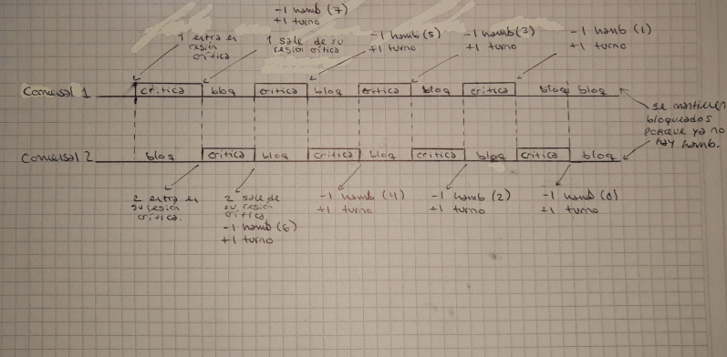

# Práctico 3
1)  a) Con hilos es una ejecución más rápida, el tiempo de ejecucuión se diferencia en aprox 1 segundo, puede depender 
    del procesador.
    b) Son muy parecidos, se mantienen en el mismo margen.
    c) Al principio daba resultados inconsistentes por race conditions, al descomentar, se soluciona.
2)  a)

    b)

